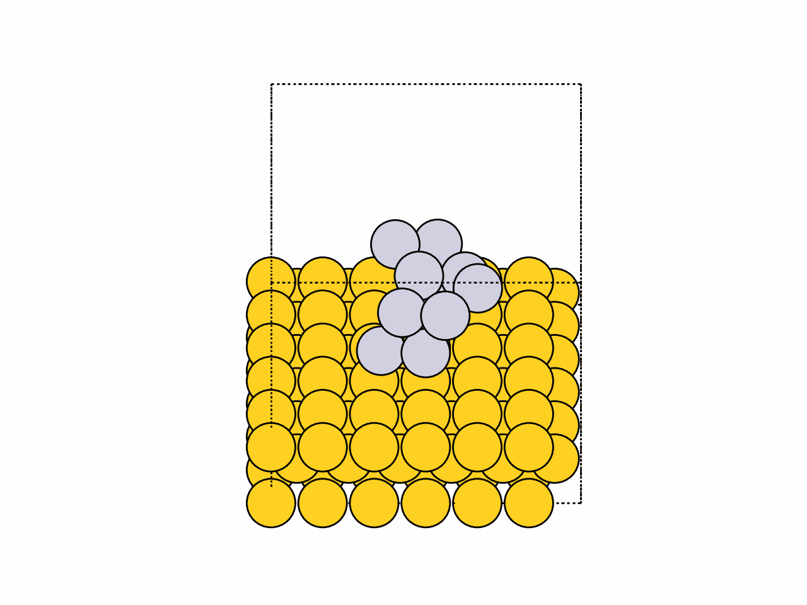
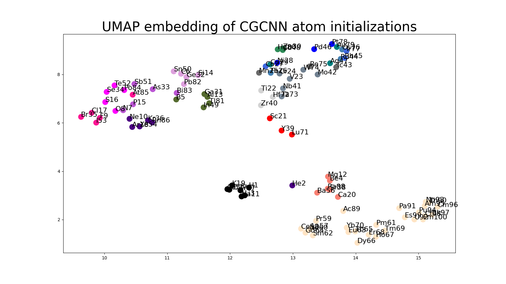

# ASE-visualizations
Visualizations of atomic systems with Atomic Simulation Environment

### Nanocluster Optimization using ASE:
Use [`optimization.ipynb`](optimization.ipynb) or [`optimization.py`](optimization.py) to run a simple optimization of a metallic nanocluster on a metallic support (using an EMT potential):

### Visualizing Periodic Trends with different Encodings and Embeddings:
Use [`periodic_tsne_khot.py`](periodic_tsne.py) or [`periodic_tsne_subplots`](periodic_tsne_subplots.py) to create 2d, static visualizations of trends in the periodic table, particularly groups, using various embeddings like T-SNE and elemental encodings:

